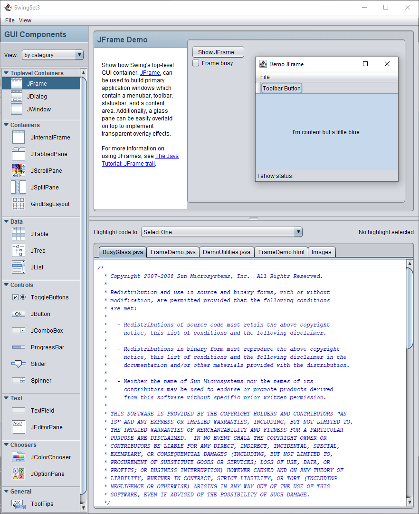

# swingset3 #

SwingSet3 Application, taken from the svn repo at https://java.net/projects/swingset3 and trunk put directly in here.

----

Here is a blogpost about [SwingSet3 Demo](https://mlapshin.com/index.php/projects/swingset3/)
from Mikhail Lapshin who worked on the project.

SwingSet3 is a demo application which highlights the components and features of the Swing user interface toolkit
in Java 6+. It showcases the Nimbus look-and-feel, but also allows you to dynamically change the look-and-feel to
other look-and-feels available on the running platform.

Another key feature of SwingSet3 is that it displays the source code for each demo and allows you to easily
highlight the specific source code fragment that was used to implement a specific aspect of that demo.

This fork compiles the SwingSet3 application to native executable using the GraalVM native-image tool,
as described in details [here](trunk/SwingSet3).

A screenshot of the running Windows native executable of the SwingSet3 application:

